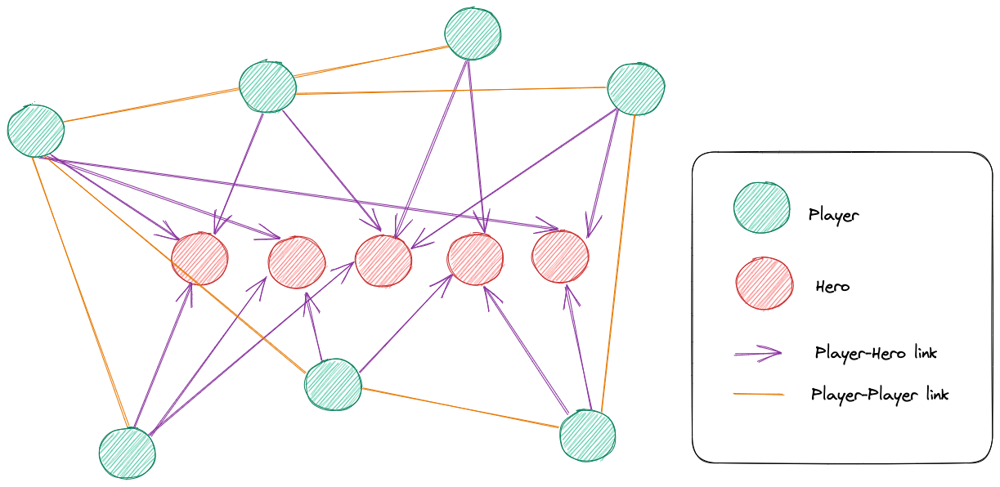
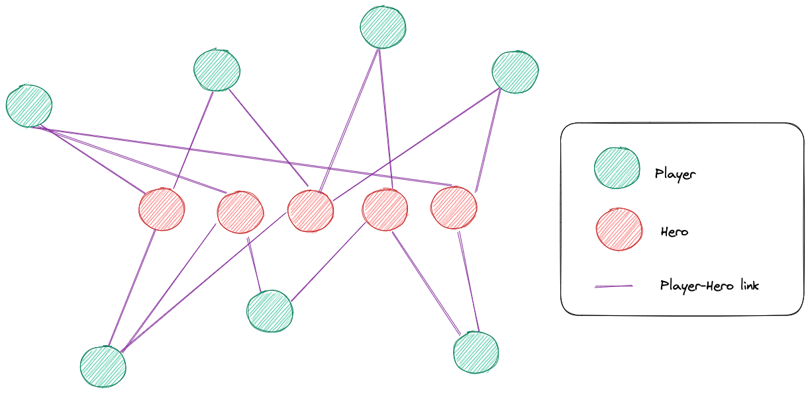
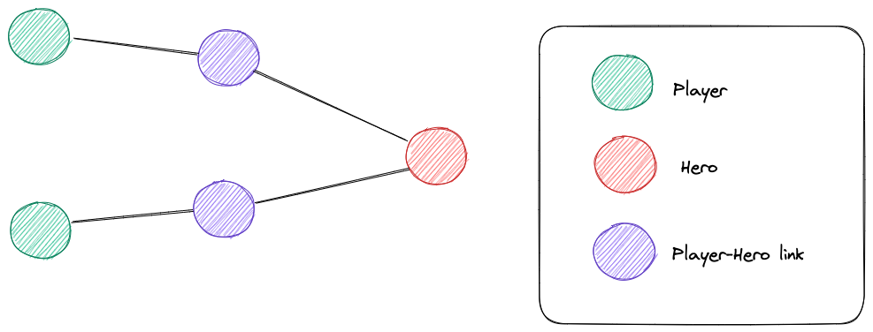
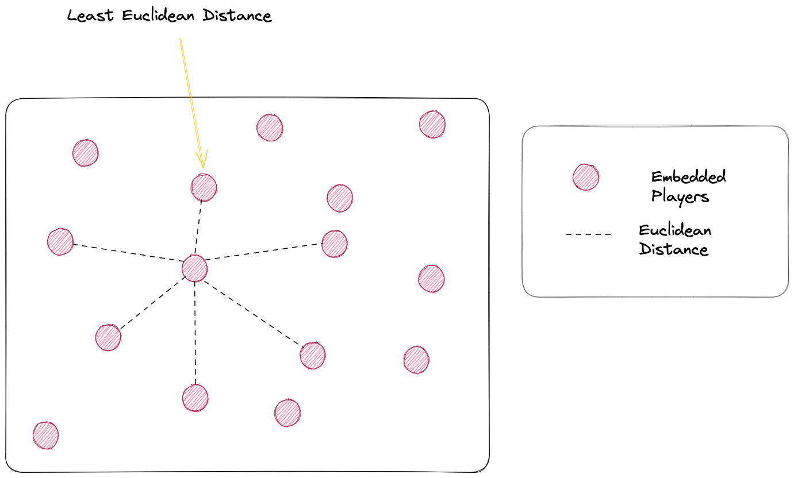

# Player compatibility can win prediction in DOTA 2 using Graph Neural Networks

## Prelude
*This research is a work-in-progress and proposed solution might change in the future. Graph Neural Networks is a vast topic, and doing a proper research takes time. However, I am keeping this open for anyone to collaborate as I believe in collaborative development and peer review. Feel free to review and contribute, it will be acknowledged.*

## Dota2

Dota 2 is a multiplayer online battle arena (MOBA) game developed and published by Valve Corporation. It is the sequel to Defense of the Ancients (DotA), which was a community-created mod for Blizzard Entertainment's Warcraft III: Reign of Chaos.

In Dota 2, two teams of five players compete against each other with the goal of destroying the enemy team's ancient, a heavily guarded structure at the center of each team's base. Each player controls a single hero, chosen from a pool of over 120 unique characters, each with their own abilities and playstyles.

The game is played on a symmetrical map divided into three lanes, with neutral territory and forests separating them. The teams start at opposite corners of the map, with their bases and ancients located at the opposite ends of the central lane.

Players earn gold and experience by killing enemy units, including heroes, creeps, and towers. Gold can be used to purchase items, which enhance a hero's abilities and attributes, while experience is used to level up a hero and unlock new abilities.

Communication and teamwork are essential in Dota 2, as each player must work with their team to coordinate their strategies and make the most of their hero's unique abilities. The game is known for its complex gameplay mechanics and steep learning curve, as well as its thriving esports scene, with millions of dollars in prize money awarded each year at international tournaments.

## e-sports

Dota 2 has a vibrant esports scene, with numerous tournaments held throughout the year featuring some of the best professional players from around the world.

The pinnacle of Dota 2 esports is The International, an annual tournament organized by Valve Corporation that brings together the best teams from around the world to compete for a multi-million dollar prize pool. The International has become one of the most prestigious esports events in the world, with fans and players alike eagerly anticipating its arrival each year.

In addition to The International, there are numerous other Dota 2 tournaments held throughout the year, both online and offline, with varying prize pools and levels of competition. Major tournaments include the Dota Pro Circuit (DPC) events, which are sponsored by Valve and offer qualification points for The International.

Dota 2 tournaments typically follow a standard format, with teams competing in a round-robin or double-elimination bracket to determine a winner. Matches are typically played in a best-of-three or best-of-five format, with the winning team advancing to the next round.

Dota 2 tournaments are often broadcast live on streaming platforms like Twitch and YouTube, with millions of fans tuning in to watch the action unfold. Commentators and analysts provide live commentary and analysis of the matches, helping viewers understand the complex strategies and gameplay mechanics involved.

Overall, Dota 2 esports tournaments are a thrilling spectacle, showcasing the highest levels of skill and teamwork in one of the most popular and competitive esports games in the world.

## Related Works

Being a highly competitive e-sport, players need a good coordination with each other. Each team can pick and ban heros from selection, and hence the team's composition matters, the players should be able to play with heros of varying skills so that the team can make a balanced selection of heros that can counter the opposition. 

Work has been done on analysing the hero composition in teams. Conley et al., 2013 [1] had created a recommendation engine for picking heros in Dota2 that will perform well against the opposing team of heros. Atish et al., 2014[1] had found a correlation between the hero selection and the chances of winning, by modelling the interactions between heros by performing logistic regression. Wang et al, 2016[3] introduced neural networks along with duration of the match as one of the features. Chen, Zhengxing et al, 2018[4] generated embeddings for hero avatars and used synergy and opposition between them to predict the probability of win. Wong et al., 2022[5] surveyed several methods for predicting the match outcome and first-blood in Dota2, based solely on pre-match team character selections. 

There is an underlying assumption to the approaches mentioned. They only model the interaction between heros, ignoring the interaction between players, assuming that each player is equally skilled. Cheng, Ziqiang et al., 2019[6] have done an analysis on the effects of team composition in MOBA games like "Honor of Kings" and found the effect of the individual players on the team composition and how it affects winning, surrendering, and abusive language in the game. Ahmad, Sabbir et al., 2019[7] have proposed a method to model individual and team behavior by labeling tactical and strategical decisions and visualize them. In a separate approach, Yang, Pu et al., 2014 [8] have used graphs to represent combat as a sequence of graphs and used the features from extracted from those graph to train a decision tree and generate graphs denoting patterns in compat that can lead to a win. These studies have shown that the interaction between players is also an important feature while modeling a system for MOBA games. 

From the above we understand that a game's result is affected by several factors including: 
- Heros Draft
- Players involved
- Team composition

In the space of representing entities and the relationship between them, a lot of developments have been made in the domain of Graph Neural Networks. Gilmer, Justin et al., 2017[11] had proposed a method to propagate between the graph and generating embeddings. Sanchez-Lengeling, et al., 2021[9] and Daigavane, et al., 2021[10] provide an illustrated overview of more such developments in GNNs. 

## Objective

By modelling the interactions between different entities involved in a game of Dota 2, we want to achieve two objectives: 
1. Generate embeddings for each player so that teams can find substitute players with comparable playing style and statistics. 
2. Predict the probability of win based on the initial draft data consisting of players and heros. 

## Why GNNs? 

Graphs have been proven extremely powerful in representation of euclidean and non-euclidean data, and have been utilised in representing social networks, texts, images, and molecules[9]. Any data which involves different entities connected by some relations can be modelled as a graph in the form of nodes and edges. GNNs, specifically, have proven useful in applications where such a graphical structure is involved. Zhou, Jie et al.[12] provide a detailed review of such methods and applications. 

The domain of Dota 2 consists of two important entities, players and heros. And they are interlinked by the following relations: 
- Player -> Hero
- Player <-> Player

This can be thought of as a graph consisting of Players and Heros as Nodes, and the relationship between them as the edges. 

*fig-1: Graph structure in the domain of Dota 2*

## Proposed Method

The proposed method consists of the following steps: 
1. Generate embeddings of individual players using the Player -> Hero graph
2. Train a link prediction model for: 
	- Player vs Player Links
	- Player vs Hero Links
3. Calculate the synergy and opposition matrix between the following as mentioned in [4]
	- Hero vs Hero
	- Player vs Player
4. Generate a graph for each match, with graph level embeddings.
5. Using the embeddings, train a graph prediction model for predicting win/win probability. 

### 1. Generating player embeddings

We take a subset of graph mentioned in *fig-1*, having only players and heros as nodes along with player-hero links. For the purpose of generating the embeddings using Random walks, we assume that the Player-Hero links are not directed. 

*fig-2: Player Hero relationships*

Each players has its set of features (rank, wins, KD, etc), and each hero has its set of features (strength, agility, intelligence, attack, etc.). The edge from player to a hero represents the player's statistics with the given hero. 
This is a representation learning task for generating node embeddings in heterogeneous networks. To perform such embeddings of players, we the metapath2vec model proposed by Dong, Yuxiao et al.[13]. Since our edges also have features, we can think of them as nodes with features. Changing the graph to the following. 

*fig-3: Player Hero relationships for metapath2vec*

To generate embeddings for the Players we use  ["player", "player-hero-link", "hero", "player-hero-link", "player"] as the metapath. 
Generating such embeddings will give us low dimensional and latent embeddings for each player. This can help us achieve our first objective. To find the substitute for a given player, we just have to find the player with the least Euclidean distance. 

*fig-4: Finding substitute players*

## References

[1] Conley, Kevin and Daniel Perry. [“How Does He Saw Me ? A Recommendation Engine for Picking Heroes in Dota 2.” (2013)](https://www.semanticscholar.org/paper/How-Does-He-Saw-Me-A-Recommendation-Engine-for-in-2-Conley-Perry/7b890df91c53b7c1a489dd5a1f30b608f5cb3546)

[2] Agarwala, Atish [“Learning Dota 2 Team Compositions.” (2014)](https://cs229.stanford.edu/proj2014/Atish%20Agarwala,%20Michael%20Pearce,%20Learning%20Dota%202%20Team%20Compositions.pdf)

[3] Wang, Weiqi. [“Predicting Multiplayer Online Battle Arena (MOBA) Game Outcome Based on Hero Draft Data.” (2016)](https://www.semanticscholar.org/paper/Predicting-Multiplayer-Online-Battle-Arena-(MOBA)-Wang/5fdc77ba44903fbfe229aa256d0919f4fbb04511)

[4] Chen, Zhengxing et al. [“Modeling Game Avatar Synergy and Opposition through Embedding in Multiplayer Online Battle Arena Games.” _ArXiv_ abs/1803.10402 (2018): n. pag.](https://www.semanticscholar.org/paper/Modeling-Game-Avatar-Synergy-and-Opposition-through-Chen-Xu/67050ffbe46164b48bdf64a91364883a8c2884ce)

[5] Wong, Nicholas Heng Loong et al. [“Predictive Analytics of First Blood and Match Outcome in Dota 2.” _TENCON 2022 - 2022 IEEE Region 10 Conference (TENCON)_ (2022): 1-6.](https://www.semanticscholar.org/paper/Predictive-Analytics-of-First-Blood-and-Match-in-2-Wong-Kwok/5b63766687e6fa7ce58859ddaea679fa2f5e3f27#references)

[6] Cheng, Ziqiang et al. [“What Makes a Good Team? A Large-scale Study on the Effect of Team Composition in Honor of Kings.” _The World Wide Web Conference_ (2019): n. pag.](https://www.semanticscholar.org/paper/What-Makes-a-Good-Team-A-Large-scale-Study-on-the-Cheng-Yang/37a1db2f1e064b7579c07721ee3fd77b6b583958)

[7] Ahmad, Sabbir et al. [“Modeling Individual and Team Behavior through Spatio-temporal Analysis.” _Proceedings of the Annual Symposium on Computer-Human Interaction in Play_ (2019): n. pag.](https://www.semanticscholar.org/paper/Modeling-Individual-and-Team-Behavior-through-Ahmad-Bryant/2266597c947d0b2407dbca5bfbf2cfa9e05b22bd)

[8] Yang, Pu et al. [“Identifying patterns in combat that are predictive of success in MOBA games.” _International Conference on Foundations of Digital Games_ (2014).](https://www.semanticscholar.org/paper/Identifying-patterns-in-combat-that-are-predictive-Yang-Harrison/9bc1cfc95bcaeb08ce460b797e6718fe522aff95)

[9] Sanchez-Lengeling, et al., ["A Gentle Introduction to Graph Neural Networks", Distill, 2021.](https://distill.pub/2021/gnn-intro/)

[10] Daigavane, et al., ["Understanding Convolutions on Graphs", Distill, 2021.](https://distill.pub/2021/understanding-gnns/)

[11] Gilmer, Justin et al. [“Neural Message Passing for Quantum Chemistry.” _ArXiv_ abs/1704.01212 (2017): n. pag.](https://www.semanticscholar.org/paper/Neural-Message-Passing-for-Quantum-Chemistry-Gilmer-Schoenholz/e24cdf73b3e7e590c2fe5ecac9ae8aa983801367)

[12] Zhou, Jie et al. [“Graph Neural Networks: A Review of Methods and Applications.” _ArXiv_ abs/1812.08434 (2018): n. pag.](https://www.semanticscholar.org/paper/Graph-Neural-Networks%3A-A-Review-of-Methods-and-Zhou-Cui/ea5dd6a3d8f210d05e53a7b6fa5e16f1b115f693)

[13] Dong, Yuxiao et al. [“metapath2vec: Scalable Representation Learning for Heterogeneous Networks.” _Proceedings of the 23rd ACM SIGKDD International Conference on Knowledge Discovery and Data Mining_ (2017): n. pag.](https://www.semanticscholar.org/paper/metapath2vec%3A-Scalable-Representation-Learning-for-Dong-Chawla/c0af91371f426ff92117d2ccdadb2032bec23d2c)

---
